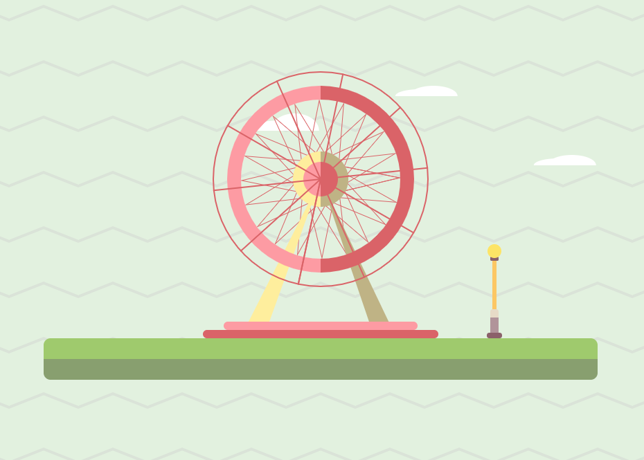

# Final Project 1
I will be visualizing time and date in this project by using ratinal variables- shape, position, value, color, texture, orientation, and size.

## Clock
This visualization includes three clocks values:
- second
    - The inner wheel of the ferris wheel, it makes one 360 degree rotation in every minute.
    - Ratinal variables: **orientation**
- minute
    - The outer wheel of the ferris wheel, it makes on3 360 degree rotation in every hour.
    - Ratinal variables: **orientation**

- hour
    - The position of the cloud in the background, it moves from left to right everyday.
    - The lightness of the light bulb, it turns from the dimmest to the lightest everyday.
    - Rational variables: **position**, **color value**.

## Date
There is one element represents day of the week, which is the zigzag lines in the background. The texture changes from the lease zigzag to the most zigzag in every week.
- Rational variables: **texture**