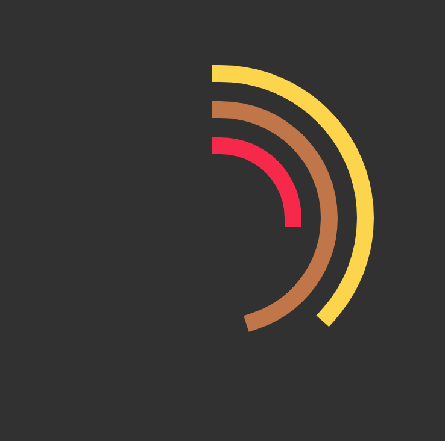
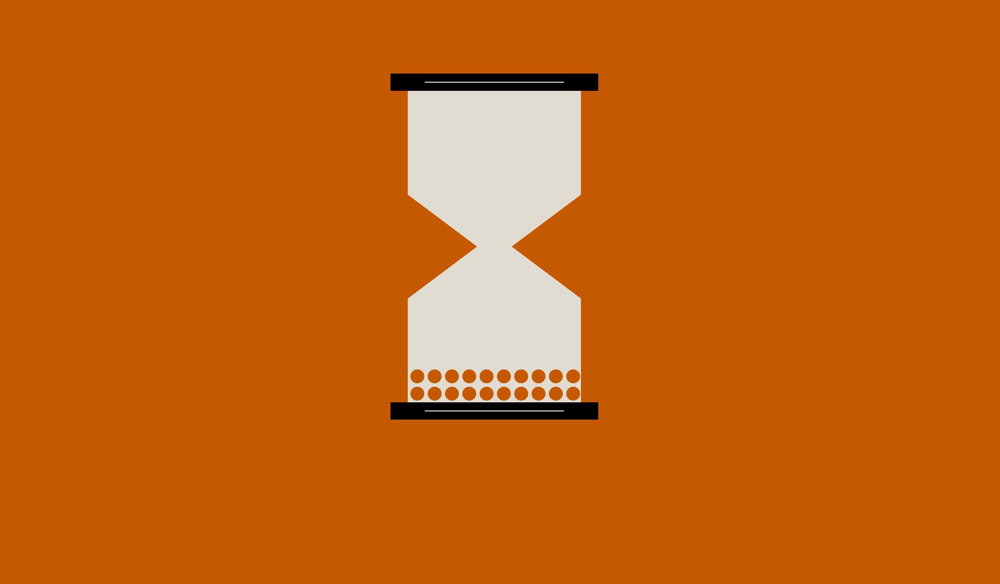
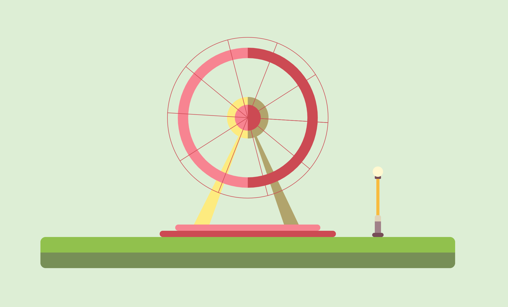

# Projects
## Clocks
In this exercise, I will be visualizing time with retinal variables: value, color, size, orientation, texture, shape, and postion. 
### IDEA I
#### Retinal Variables:
- value
- size
#### Concept
This concept simulates an analog clock. The outer arc represents seconds, the middle arc represents minutes, the inner arc represents hours. Two sets of colors changes based on `now.am` and `now.pm`. The color value of the background changes from 0-255 every day. 

#### Concept

### IDEA II - Hourglass
#### Retinal Variables:
- position
- color
#### Concept
This concept simulates the idea of hourglass. Each dot represents one second. The background color the dot color changes from one to another in every hour gradually.  

### IDEA III - Seesaw
#### Retinal Variables:
- texture
- orientation
#### Concept
This concept simulates the idea of seesaw. The background texture changes over hours gradually. One side of the seesaw touches the ground every second, and then the other side touches the ground.  

## Date
### IDEA I - tree color
#### Retinal Variables:
- position
- color
#### Concept
The color of the trees and the background changes gradually in a year. The position of the clouds changes repeatedly everyday.  

### IDEA II - ferris wheel
#### Retinal Variables:
- orientation
- value
#### Concept
The ferries wheel makes one rotation in a year. The color value of the light bulb changes from dimmest to the lightest in a day.  

### IDEA III - time machine
#### Retinal Variables:
- texture
- size
#### Concept
The ball on the top drops into the triangle everyday. The measurement bar increases gradualy in a year. The texture of the 4 dots changes when a sesason is ended.  

